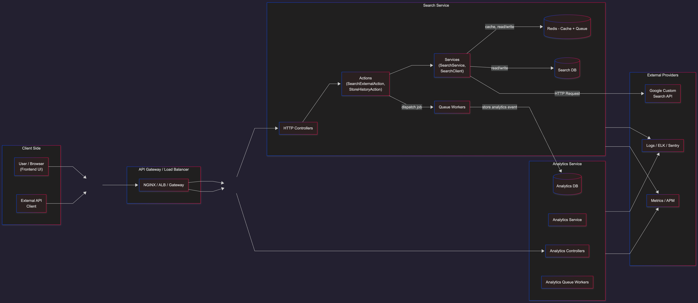

# 🔎 Google Custom Search – Search & Analytics Platform


A Laravel-based Search & Analytics backend that integrates with **Google Custom Search JSON API**, supports **Redis caching and queues**, tracks **search analytics**, and provides an **Inertia + Vue admin dashboard** for reporting and insights.

This project follows a modular clean architecture style:
Controller → Action → Service → External Provider → DB + Queue → Analytics


---

## 📦 Features

| Feature | Description |
|--------|-------------|
| 🌐 Public Search API | `/api/search?q=keyword` calls Google Custom Search |
| 📚 Search History | Stores each search, result count, and provider metadata |
| 📊 Analytics Events (Async) | Queued job: `RecordSearchPerformedJob` |
| 📈 Admin Analytics Panel | `/admin/analytics` (Inertia + Vue) with summaries + recent searches |
| 🚀 Redis Queue + Cache | Faster repeated search queries + async processing |
| 🛡 Sentry Integration | Automatic error reporting including queue failures |
| 💾 Failed Jobs Monitoring | Failed queue jobs stored in `failed_jobs` table |
| 🧪 Postman / Browser Friendly | Simple JSON API for external clients |

---

## 🏗 System Design Overview


---

## 🗄 Technology Stack

| Category | Tech |
|---------|------|
| Language | PHP 8+, Composer |
| Framework | Laravel 10 |
| Frontend Admin | Breeze (Inertia + Vue 3 + Vite) |
| External Provider | Google Custom Search JSON API |
| Database | MySQL / MariaDB / PostgreSQL |
| Cache / Queue | Redis (Predis) |
| Observability | Laravel Logs + Sentry |
| Auth | Laravel Breeze Auth Scaffolding |

---

## ⚙️ Installation & Setup

### 1️⃣ Clone & Install

```bash
git clone <repo-url> googlecustomsearch
cd googlecustomsearch
composer install
npm install
```

### 2️⃣ Environment
```bash
cp .env.example .env
php artisan key:generate
```

Set DB + Redis + Google Search API keys:
```bash
APP_NAME="GoogleCustomSearch"
APP_URL=http://127.0.0.1:8000

DB_DATABASE=googlecustomsearch

# Google Custom Search API
SEARCH_PROVIDER=google
SEARCH_API_ENDPOINT=https://www.googleapis.com/customsearch/v1
SEARCH_API_KEY=your_google_api_key_here
GOOGLE_SEARCH_ENGINE_ID=your_google_cx_here

# Redis
CACHE_DRIVER=redis
QUEUE_CONNECTION=redis
REDIS_CLIENT=predis
REDIS_HOST=127.0.0.1
REDIS_PORT=6379

# Sentry (optional but recommended)
SENTRY_LARAVEL_DSN=your_sentry_dsn_here
SENTRY_ENVIRONMENT=local

```

### 3️⃣ Migrate
```bash
php artisan migrate
```

### 4️⃣ Run App
```bash
php artisan serve
npm run dev
```

### 5️⃣ Start Queue Worker
```bash
php artisan queue:work redis
```

---

## 🔍 Public Search API

### Endpoint
```bash
GET /api/search?q=cat
```

### Example Response
```bash
{
  "query": "cat",
  "results": {
    "items": [
      { "title": "...", "link": "...", "snippet": "..." }
    ],
    "searchInformation": {
      "totalResults": "11500000"
    }
  }
}

```

## 📊 Admin Analytics Dashboard

### URL
```bash
/admin/analytics
```

Shows:

- Total Searches

- Unique Queries

- Last Search Time

- Recent Searches Table

### Backend API:
```bash
GET /admin/analytics/summary
```

---
### 🧪 Testing & CI
## Local test environment
Create .env.testing (already included in repo) and run tests with in-memory SQLite:
```bash
php artisan test
# or
vendor/bin/phpunit --testdox
```
Example successful output:
```bash
Tests: 31 passed (70 assertions)
Duration: 8.31s
```
Test suite coverage & philosophy
- Core unit tests cover the SearchService, SearchClient, StoreHistoryAction, and RecordSearchPerformedJob.
- Tests use in-memory SQLite (DB_CONNECTION=sqlite, DB_DATABASE=:memory:), CACHE_DRIVER=array, and QUEUE_CONNECTION=sync to remain fast and deterministic.
- External HTTP calls are faked using Http::fake().

## CI (GitHub Actions)
- A GitHub Actions workflow runs the test suite, builds frontend assets, and uploads Laravel logs on each push/PR:
```bash
.github/workflows/phpunit.yml
```
Badge (auto-updates after workflow runs):


---

### 🗃 Database Entities

### search_histories
| Column        | Description              |
| ------------- | ------------------------ |
| query         | Search term              |
| provider      | e.g., `google`           |
| results_count | Number of returned items |
| results_raw   | JSON stored result       |
| timestamps    | created_at, updated_at   |


### analytics_events
| Column        | Description            |
| ------------- | ---------------------- |
| event_type    | `search_performed`     |
| query         | Search term            |
| results_count | Metric                 |
| provider      | Source provider        |
| meta          | JSON optional          |
| timestamps    | created_at, updated_at |


### failed_jobs
- Stores queue exceptions for manual review + retry.

---

## 🚦 Observability & Error Reporting
### Laravel Logs
Located in:
```bash
storage/logs/laravel.log
```

Search client logs events such as:
```bash
search.external.completed
search.external.failed
```

## Sentry Integration
Automatically captures:
- API unhandled exceptions
- Queue job failures

Test:
```bash
php artisan sentry:test
```

---

### 🧪 Redis Cache Verification
```bash
redis-cli
> SELECT 1
> KEYS *search*
```

---

### 🤝 Contributing
Open to improvements! Feel free to submit PRs or issues.

---

### 📝 License
MIT License. Free to use and modify.

---
### 👨‍💻 Author
Built with ❤️ for a search/analytics system demonstration.